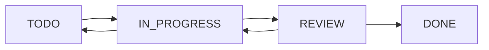

# 🎯 Work Task Manager

> Современный менеджер задач в стиле Jira, построенный на Next.js с интеграцией внешнего API

[](https://nextjs.org/)
[](https://www.typescriptlang.org/)
[](https://tailwindcss.com/)
[](https://tanstack.com/query)

## ✨ Особенности

- 🔐 **JWT Аутентификация** с автоматическим обновлением токенов
- 📊 **Kanban доска** с drag-and-drop функциональностью
- 📈 **Аналитика проектов** и отчеты по задачам
- 👥 **Управление командой** и ролями пользователей
- 🎨 **Современный UI** с темной/светлой темой
- 📱 **Адаптивный дизайн** для всех устройств
- ⚡ **Высокая производительность** с оптимизацией Next.js

## 🚀 Быстрый старт

### Предварительные требования

- Node.js 18+ 
- npm/yarn/pnpm
- Доступ к внешнему API

### Установка

1. **Клонируйте репозиторий**
   ```bash
   git clone https://github.com/EgorKru/wt-manager.git
   cd wt-manager
   ```

2. **Установите зависимости**
   ```bash
   npm install
   # или
   yarn install
   # или
   pnpm install
   ```

3. **Настройте переменные окружения**
   ```bash
   cp .env.example .env.local
   ```
   
   Отредактируйте `.env.local`:
   ```env
   # API Configuration
   API_BASE_URL=http://91.211.249.37/test
   API_VERSION=/work-task/v1
   
   # App Configuration
   NEXT_PUBLIC_APP_URL=http://localhost:3000
   ```

4. **Запустите проект**
   ```bash
   npm run dev
   ```

5. **Откройте браузер**
   
   Перейдите на [http://localhost:3000](http://localhost:3000)

## 📋 API Интеграция

Приложение интегрируется с внешним API со следующими эндпоинтами:

### Аутентификация
- `POST /auth/login` - Вход в систему
- `POST /auth/refresh` - Обновление токена

### Проекты
- `GET /projects/users-projects` - Получение проектов пользователя
- `POST /projects/set-project/{id}` - Установка активного проекта
- `POST /projects/create-project` - Создание проекта

### Задачи
- `PUT /task/update-status` - Обновление статуса задачи

## 🏗️ Архитектура

### Структура проекта

```
src/
├── app/                    # App Router (Next.js 13+)
│   ├── (auth)/            # Группа маршрутов аутентификации
│   ├── (dashboard)/       # Основное приложение
│   └── (standalone)/      # Отдельные страницы
├── components/            # Переиспользуемые компоненты
│   └── ui/               # UI компоненты (shadcn/ui)
├── features/             # Функциональные модули
│   ├── auth/             # Аутентификация
│   ├── projects/         # Управление проектами  
│   ├── tasks/            # Управление задачами
│   └── workspaces/       # Рабочие области
└── lib/                  # Утилиты и сервисы
    ├── api/              # API клиенты и сервисы
    ├── auth/             # Аутентификация
    ├── storage/          # Работа с данными
    └── legacy/           # Совместимость
```

### Технологический стек

**Frontend:**
- ⚛️ React 18 с Server Components
- ⚡ Next.js 15 с App Router
- 🎨 Tailwind CSS + shadcn/ui
- 📊 React Query для состояния сервера
- 🖱️ React Beautiful DnD для drag-and-drop

**Backend Integration:**
- 🔌 REST API клиент с автоматическим refresh токенов
- 💾 LocalStorage для кеширования данных
- 🍪 Cookie-based аутентификация

## 🔧 Разработка

### Команды

```bash
# Разработка
npm run dev

# Сборка
npm run build

# Запуск production сборки
npm run start

# Линтинг
npm run lint

# Проверка типов
npm run type-check
```

### Переменные окружения

| Переменная | Описание | Пример |
|------------|----------|---------|
| `API_BASE_URL` | Базовый URL API | `http://91.211.249.37/test` |
| `API_VERSION` | Версия API | `/work-task/v1` |
| `NEXT_PUBLIC_APP_URL` | URL приложения | `http://localhost:3000` |

## 👥 Роли пользователей

- **👑 Admin** - Полный доступ ко всем функциям
- **🏢 Owner** - Управление workspace и проектами
- **👤 Regular User** - Работа с задачами в назначенных проектах

## 🎨 UI/UX Особенности

- **🌙 Темная тема** по умолчанию
- **📱 Мобильная адаптация** для всех экранов
- **⌨️ Горячие клавиши** для быстрой навигации
- **🔄 Оптимистичные обновления** для лучшего UX
- **📊 Интерактивные графики** и аналитика

## 🔄 Состояния задач



## 🤝 Участие в разработке

1. Форкните репозиторий
2. Создайте feature ветку (`git checkout -b feature/amazing-feature`)
3. Зафиксируйте изменения (`git commit -m 'Add amazing feature'`)
4. Отправьте в ветку (`git push origin feature/amazing-feature`)
5. Создайте Pull Request

## 📄 Лицензия

Этот проект лицензирован под MIT License - см. файл [LICENSE](LICENSE) для подробностей.

## 🙏 Благодарности

- [shadcn/ui](https://ui.shadcn.com/) за отличные UI компоненты
- [Lucide](https://lucide.dev/) за красивые иконки
- [Tailwind CSS](https://tailwindcss.com/) за CSS фреймворк
- [Next.js](https://nextjs.org/) за отличный React фреймворк

---

<div align="center">
  Сделано с ❤️ для эффективного управления задачами
</div>
